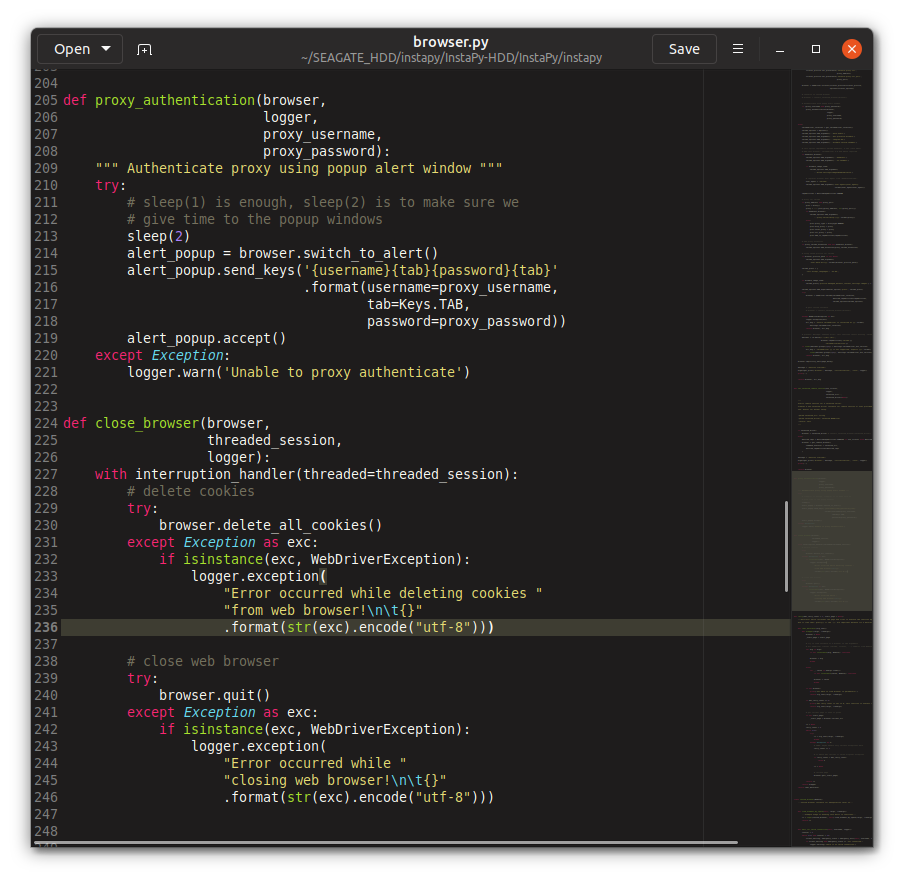

# gruvbox-monokai-gedit
Combination of Gruvbox and Monokai theme for Gedit



How to install:

- Download and move to one of folders below. 
- Change theme in Gedit settings.

```bash
wget https://raw.githubusercontent.com/hattorihan/gruvbox-monokai-gedit/master/dark_monokai.xml
```

System wide:

```bash
/usr/share/gtksourceview-4/styles
```

User wide:

```bash
~/.local/share/gtksourceview-4/styles/
```
